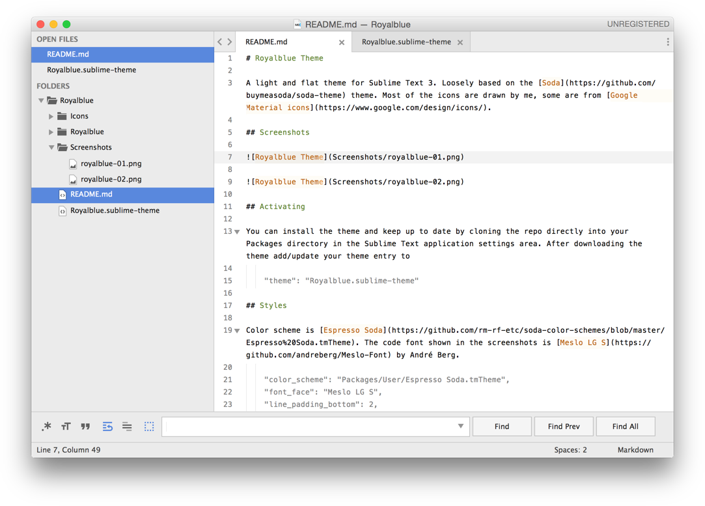
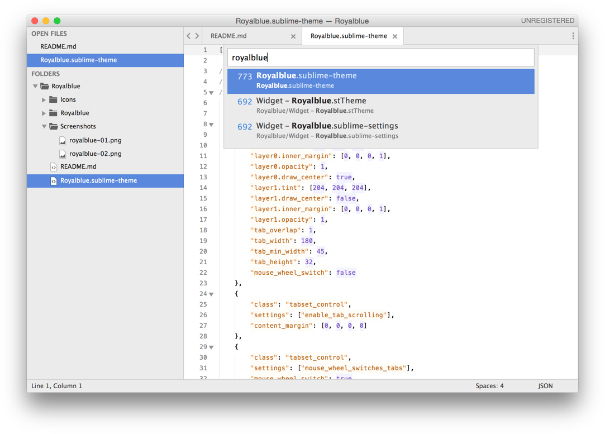

# Royalblue Theme

A light and flat theme for Sublime Text 3. Loosely based on the [Soda](https://github.com/buymeasoda/soda-theme) theme. Most of the icons are drawn by me, some are from [Google Material icons](https://www.google.com/design/icons/).

## Screenshots

## Activating

You can install the theme and keep up to date by cloning the repo directly into your Packages directory in the Sublime Text application settings area. After downloading the theme add/update your theme entry to 
    
    "theme": "Royalblue.sublime-theme"

## Styles

Color scheme is [Espresso Soda](https://github.com/rm-rf-etc/soda-color-schemes/blob/master/Espresso%20Soda.tmTheme). The code font shown in the screenshots is [Meslo LG S](https://github.com/andreberg/Meslo-Font) by André Berg. 

    "color_scheme": "Packages/User/Espresso Soda.tmTheme",
    "font_face": "Meslo LG S",
    "line_padding_bottom": 2,
    "line_padding_top": 2,
    "font_size": 11